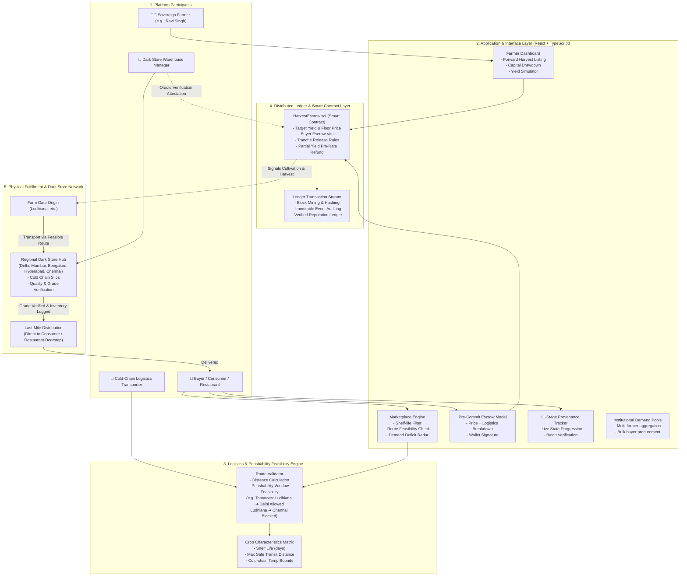
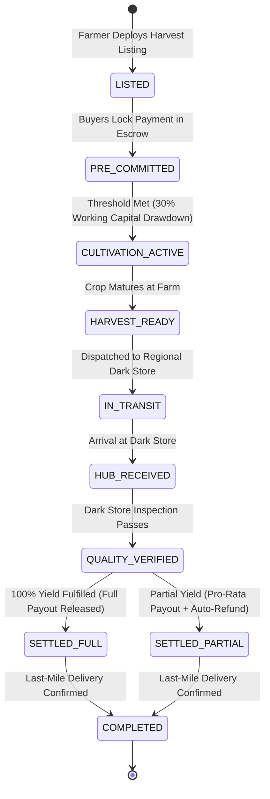
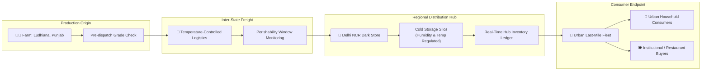
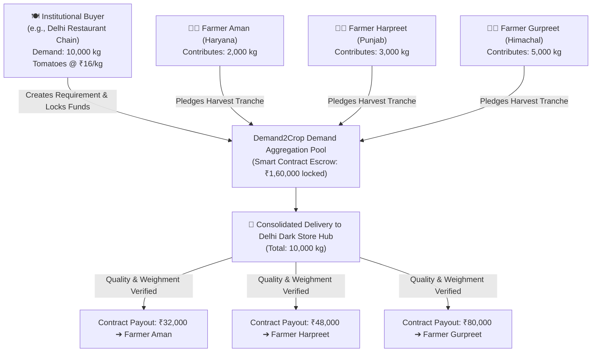

# Demand2Crop — System Architecture & Workflow Flowcharts

> **Core Value Paradigm:** *"Instead of farmers growing first and searching for buyers later, buyers commit demand first and farmers grow against that demand."*

---

## 1. High-Level End-to-End System Architecture

---

## 2. Core Operational Flow: From Demand Commitment to Final Settlement

```mermaid
flowchart TD
    START(["Farmer Plans Future Cultivation"]) --> A1["Farmer creates Future Harvest Listing\n(Crop, Target Yield, Pre-Commit Price, Harvest Date, Hub)"]
    A1 --> A2["Smart Contract (HarvestEscrow.sol) Initialized on Ledger"]
    A2 --> B1["Buyer discovers listing on Marketplace\n(System checks Perishability & Distance Feasibility)"]

    B1 --> B2{"Is Route Feasible for Crop Shelf-life?"}
    B2 -- No --> B_REJECT["Buyer Alerted: Exceeds safe transit shelf-life\nRoute Prohibited to Prevent Spoilage"]
    B2 -- Yes --> B3["Buyer selects desired quantity (e.g., 100 kg Wheat)"]

    B3 --> C1["Buyer initiates Pre-Commitment"]
    C1 --> C2["Escrow Lock: Product cost + estimated freight locked in contract"]
    C2 --> C3["Farmer Dashboard updates in real time\n(Committed: 650 kg ➔ 750 kg)"]

    C3 --> D1{"Target Commitment Threshold Reached?"}
    D1 -- Yes --> D2["Tranche 1 Unlocked: 30% Working Capital released to Farmer\n(Zero-interest liquidity for seeds & inputs)"]
    D1 -- In Progress --> D3["Farmer continues cultivation against locked demand"]

    D2 --> E1["Farmer completes Cultivation & Harvest"]
    D3 --> E1

    E1 --> F1{"Actual Yield vs Promised Yield?"}
    F1 -- "Normal Harvest (100%)" --> G1["1,000 kg shipped to Regional Dark Store"]
    F1 -- "Partial Yield (e.g., 700 kg)" --> G2["Simulate Partial Harvest Triggered:\n- Farmer receives payment for 700 kg\n- 300 kg unfulfilled portion automatically refunded to buyers"]

    G1 --> H1["Dark Store Manager inspects & verifies quality grade"]
    G2 --> H1

    H1 --> H2["Oracle confirms receipt at Dark Store Hub\nInventory updated in Hub Silos"]
    H2 --> I1["Tranche 2 Unlocked: Final farmer payout disbursed"]
    I1 --> I2["Farmer On-Chain Reputation Score updated (+1 completed harvest)"]
    I2 --> J1["Last-mile delivery dispatched from Dark Store to Buyer"]
    J1 --> END(["Order Delivered & Transaction Finalized on Ledger"])
```

---

## 3. Smart Contract Escrow State Machine (`HarvestEscrow.sol`)

---

## 4. Multi-Node Logistics & Dark Store Pipeline

---

## 5. Institutional Demand Aggregation Pool (B2B Multi-Farmer Model)

---

## 6. Crop-Specific Perishability & Logistics Feasibility Matrix

| Crop Type | Shelf Life | Max Transport Radius | Storage Type | Feasible Route Example | Infeasible Route Example |
| :--- | :---: | :---: | :---: | :--- | :--- |
| **Wheat (Sharbati)** | 180–360 Days | 2,500+ km | Dry Aerated Silos | Ludhiana $\rightarrow$ Delhi / Chennai ✅ | None (National reach) |
| **Basmati Rice** | 360+ Days | 2,500+ km | Ambient Moisture-Controlled | Karnal $\rightarrow$ Mumbai / Hyderabad ✅ | None (National reach) |
| **Potatoes** | 30–60 Days | 1,200 km | Cool Ventilated | Agra $\rightarrow$ Delhi / Kolkata ✅ | Agra $\rightarrow$ Kochi ⚠️ (Requires Reefers) |
| **Tomatoes** | 2–4 Days | 350 km | Cold Chain (10–12°C) | Ludhiana $\rightarrow$ Delhi (310 km) ✅ | Ludhiana $\rightarrow$ Chennai (2,100 km) ❌ |
| **Green Spinach** | 1–2 Days | 150 km | Hydro-Cooled (2–4°C) | Sonepat $\rightarrow$ Delhi NCR (60 km) ✅ | Sonepat $\rightarrow$ Mumbai ❌ |
| **Alphonso Mangoes**| 7–10 Days | 800 km | Controlled Atmosphere | Ratnagiri $\rightarrow$ Mumbai / Pune ✅ | Ratnagiri $\rightarrow$ Delhi ⚠️ (Fast express only) |
